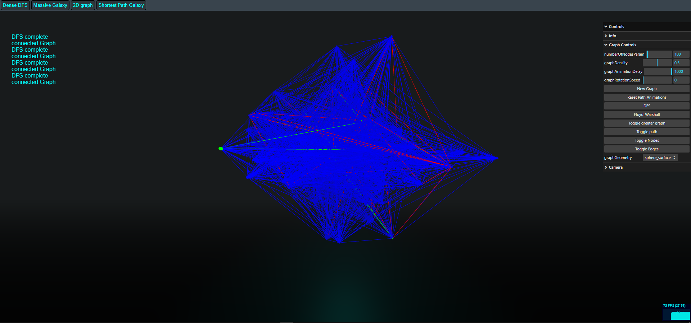
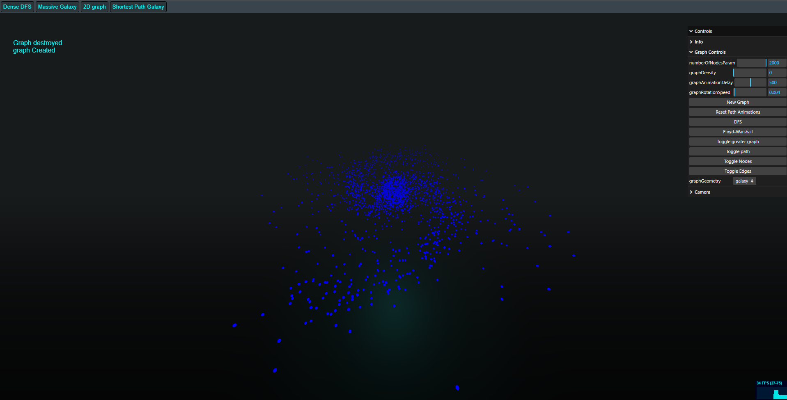

# Graph Visulizer

## Description

This project is a application that leverages WebGL through Three.js, and is built using Webpack and Node.js. It implements a Depth-First Search (DFS) algorithm for graphical exploration and utilizes the Floyd-Warshall algorithm for finding the shortest paths in a weighted graph, including path reconstruction.

**Warning:** Due to its computational intensity, this application may cause performance issues or crashes in some browsers.

## Built With

- Webpack
- Node.js
- Three.js




## Animated Algorithms

- **DFS Algorithm:** Traverses complex graphs efficiently.
- **Floyd-Warshall Algorithm:** Finds shortest paths and reconstructs them, allowing for detailed path analysis.

## Known Issues and Bugs

- **Floyd-Warshall Limitation:** There's an unidentified bug where the Floyd-Warshall algorithm doesn't always function as expected. Investigation and debugging are ongoing.

## Future Improvements

- **Interactive Nodes:** Plans to add functionality for users to click on nodes to select paths manually.
- **Enhanced Graphical Models:** More intricate graphs to model real-world objects and scenarios are being considered.

## Installation and Usage

To get this project up and running on your local machine:

1. **Prerequisite: Install Node.js and npm:**
   - Ensure you have Node.js and npm installed on your system. If not, download and install from [Node.js official website](https://nodejs.org/).

2. **Clone the Repository:**
   - `git clone https://github.com/brendanb2023/graph_algo_visualizer.git`

3. **Install Dependencies:**
   - Navigate to the project directory and run:
     ```
     npm install
     ```

4. **Run the Development Server:**
   - To start the development server, run:
     ```
     npm run dev
     ```
   - This will start the server and the application should be accessible on your local machine.

